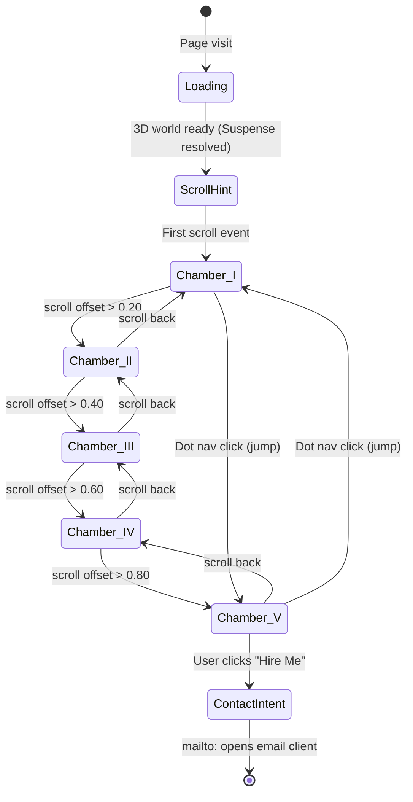

# 03 — App Flow & UX Journey
# PRIAM's Pantheon — Cinematic 3D Portfolio

---

## 1. High-Level Navigation Model

This site has **no traditional navigation**. There are no page routes, no anchor scroll-jumps, no tab switching. The entire experience is a single continuous 3D journey driven by the browser's native scroll event, normalized by `ScrollControls` from `@react-three/drei`.

```
Single route: /
  └── One continuous 3D scroll journey (0% → 100%)
        ├── 0–20%   → Chamber I: Temple Entrance
        ├── 20–40%  → Chamber II: The Arsenal
        ├── 40–60%  → Chamber III: The Gallery Wing
        ├── 60–80%  → Chamber IV: The Sanctum
        └── 80–100% → Chamber V: The Oracle
```

---

## 2. Full User Journey — State Machine



---

## 3. Scroll Progress → Chamber Mapping

| Scroll Offset | Chamber | Camera Z range | Active Dot |
|---|---|---|---|
| 0.00 – 0.20 | I — Temple Entrance | z: +12 → -25 | ● ○ ○ ○ ○ |
| 0.20 – 0.40 | II — The Arsenal | z: -25 → -65 | ○ ● ○ ○ ○ |
| 0.40 – 0.60 | III — The Gallery Wing | z: -65 → -105 | ○ ○ ● ○ ○ |
| 0.60 – 0.80 | IV — The Sanctum | z: -105 → -140 | ○ ○ ○ ● ○ |
| 0.80 – 1.00 | V — The Oracle | z: -140 → -165 | ○ ○ ○ ○ ● |

---

## 4. Chamber-by-Chamber UX Flow

### Chamber I — Temple Entrance (Hero)
**Entry trigger:** Page load complete  
**Camera motion:** Starts outside temple, glides forward through entrance arch  
**3D elements visible:**
- Giant "PRIAM" in lime 3D text
- "Mike G. Nervil — Brand & Web" subtitle
- Temple columns on both sides
- Dense lime particle field  

**Overlay visible:**
- PRIAM logo (top-left)
- "Hire Me" button (top-right)
- "SCROLL TO EXPLORE ↓" hint (center-bottom) — fades on first scroll
- Dot nav: dot 1 active
- Audio toggle (top-right, beside Hire Me) — Greek ambient starts muted

**User actions available:**
- Scroll down → enter Arsenal
- Click "Hire Me" → scroll-jump to Oracle (offset 0.85)
- Click dot 2–5 → scroll-jump to that chamber
- Click audio toggle → start/stop ambient track

---

### Chamber II — The Arsenal (Services)
**Entry trigger:** offset crosses 0.20  
**Camera motion:** Pure smooth glide into the hall; pans slightly to reveal plinths  
**3D elements visible:**
- 4 marble plinths in 2×2 formation
- Floating lime orb above each plinth
- `<Html>` service cards on each plinth:
  - 🎨 Brand Identity
  - 💻 Web Development  
  - 🖼️ UI/UX Design
  - 📣 Marketing Assets
- Column corridor continues

**Overlay visible:**
- Chamber label fades in: "II — The Arsenal"
- All persistent overlay elements remain

**User actions:**
- Hover plinth orb → orb brightens, service card scales up slightly
- Scroll → continue to Gallery

---

### Chamber III — The Gallery Wing (Work)
**Entry trigger:** offset crosses 0.40  
**Camera motion:** Camera turns slightly, as if entering a side wing; pans along "walls"  
**3D elements visible:**
- 6 floating frames (3 per imaginary wall side)
- Each frame: lime-bordered rectangle + `<Html>` project card inside:
  - Project name
  - Category badge (Brand / Web / UI)
  - "View →" link (external URL from `data/projects.ts`)
- Frame glow on nearest frames (distance-based emissive)

**Overlay visible:**
- Chamber label: "III — The Gallery Wing"
- All persistent overlay elements

**User actions:**
- Hover frame → frame brightens, card scales 1.05
- Click "View →" → opens project URL in new tab
- Scroll → continue to Sanctum

---

### Chamber IV — The Sanctum (About)
**Entry trigger:** offset crosses 0.60  
**Camera motion:** Camera slows, slight elevation gain — intimate pull-in  
**3D elements visible:**
- Large ornate portrait frame (center) with picsum placeholder image via `<Html>`
- 3 small stat plinths in arc: "5+ Years" / "40+ Projects" / "20+ Clients"
- Roman arch framing the chamber entrance
- Sparser particles — more intimate atmosphere

**Overlay visible:**
- Chamber label: "IV — The Sanctum"
- All persistent overlay elements

**`<Html>` content visible:**
- Bio quote: *"I don't just design and build — I craft digital legacies."*
- Name + title: Mike G. Nervil — Creative Director & Web Architect

**User actions:**
- Read bio / stats
- Scroll → continue to Oracle

---

### Chamber V — The Oracle (Contact)
**Entry trigger:** offset crosses 0.80  
**Camera motion:** Camera arrives at altar — final destination, gentle stop  
**3D elements visible:**
- Central altar (RoundedBox geometry)
- Lime light pulsing from altar surface (PointLight with animated intensity)
- Dense lime particle halo around altar

**`<Html>` content visible:**
- Heading: "Let's Build Something Great"
- Subtext: "Ready to elevate your brand and digital presence?"
- Primary CTA button: "Hire Me" → `mailto:priamnervil@gmail.com`
- Social links row: Instagram · LinkedIn · Behance

**Overlay visible:**
- Chamber label: "V — The Oracle"
- All persistent overlay elements

**User actions:**
- Click "Hire Me" → mailto opens
- Click social links → new tab
- Scroll back up → return journey

---

## 5. Overlay UI Behavior

### OverlayNav (always visible)
```
[PRIAM wordmark]  ─────────  [🔊] [Hire Me →]
                      ● ○ ○ ○ ○   ← chamber dots
```
- Logo: links to scroll offset 0 (top of page / jump to entrance)
- Dots: clicking dot N scroll-jumps to that chamber's start offset
- "Hire Me": scroll-jumps to Oracle (offset 0.85)
- Audio toggle: 🔇/🔊 — controls ambient audio play/pause

### ChamberLabel (bottom-center)
- Fades in when offset crosses chamber threshold
- Fades out during transition (offset within 0.02 of boundary)
- Format: Roman numeral + name — "I — The Entrance"

### ScrollHint (center-bottom, Chamber I only)
- Visible on load
- Fades out after first scroll event (offset > 0.005)
- Never reappears

---

## 6. Error / Edge States

| State | Behavior |
|---|---|
| WebGL unavailable | Show static full-screen fallback: dark page with PRIAM text + contact link |
| Asset load fails | Suspense error boundary catches, shows minimal error message |
| Mobile (< 768px) | `performanceMonitor` halves particle count, disables post-processing bloom; experience remains fully functional |
| Reduced motion | `prefers-reduced-motion: reduce` — camera lerp factor increases to near-instant (no slow drift) |
| mailto not configured | Fallback: copies email to clipboard, shows toast notification |

---

## 7. Dot Navigation — Jump Logic

```typescript
// Saut direct vers une chambre via les points de navigation
const CHAMBER_OFFSETS = [0.0, 0.22, 0.42, 0.62, 0.82]

function jumpToChamber(index: number) {
  // Anime le scroll de façon programmatique vers l'offset cible
  scrollTo(CHAMBER_OFFSETS[index])
}
```

Scroll-jumping is handled by programmatically setting the ScrollControls internal scroll position via a ref exposed from the scroll context.
